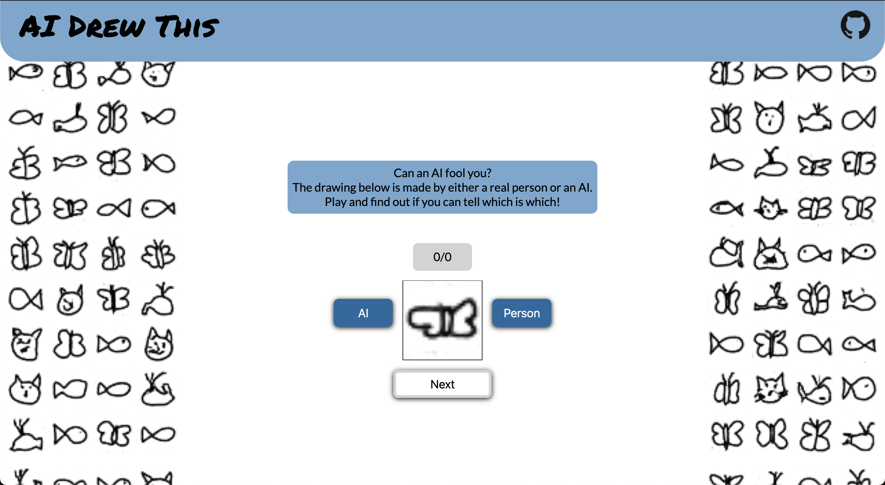
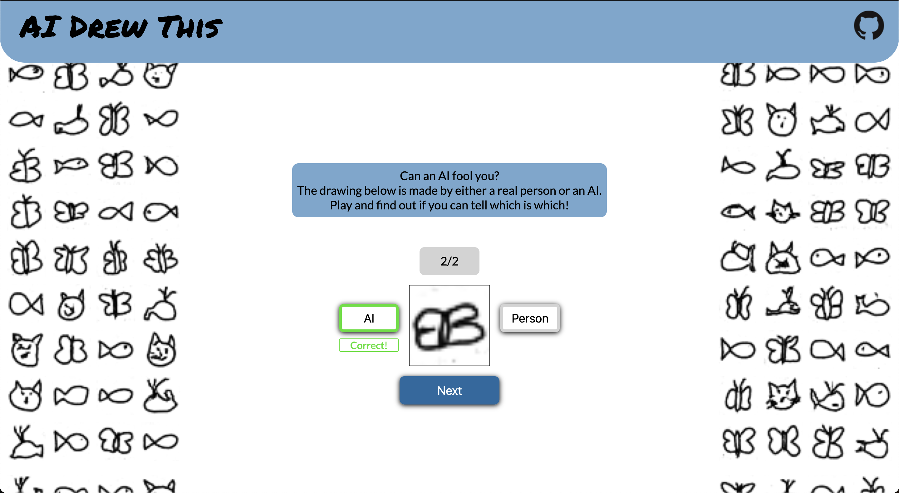

# AI Drew This
This project is a simple game made with Flask and Tensorflow.
The game presents you with a drawing either made by a person or by an AI. The goal of the game is to correctly identify as many drawings as you can.

## Technologies
Project is created with
* Tensorflow 2.7
* Flask 2.0
* Gunicorn 20.1

## Setup
To run this project locally install the requirements using pip:
```
$ cd ~/ai_drew_this
$ pip install -r requirements.txt
$ python run.py
```
The site can then be visited at [http://localhost:8080/](http://localhost:8080/).

To run in a Docker container execute the following:
```
$ cd ~/ai_drew_this
$ docker build . -t aidrewthis
$ docker run -p 80:8080 --restart=on-failure aidrewthis
```

## Screenshots




## Sources
Drawings made by people are taken from the [Google Quick, Draw! dataset](https://github.com/googlecreativelab/quickdraw-dataset).

Drawings made by the AI are generated by a GAN model made and trained by me. More information on the model can be found at [Quick Draw GAN](https://github.com/AlexanderMertens/quick_draw_gan).